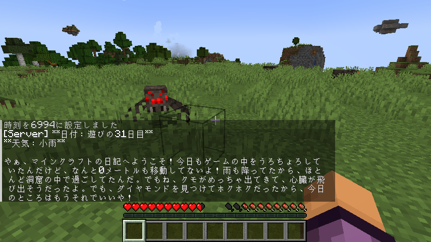
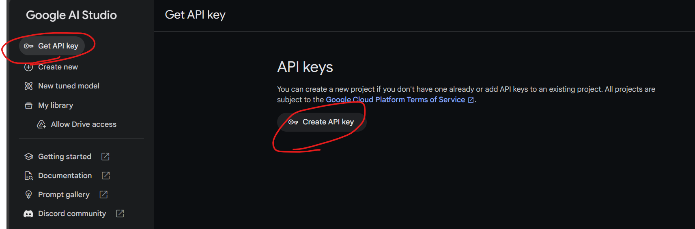
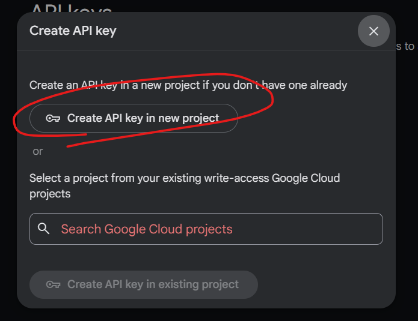
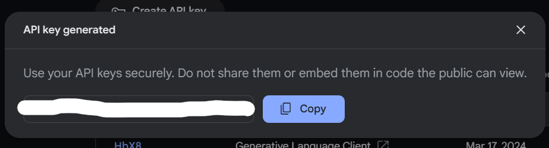
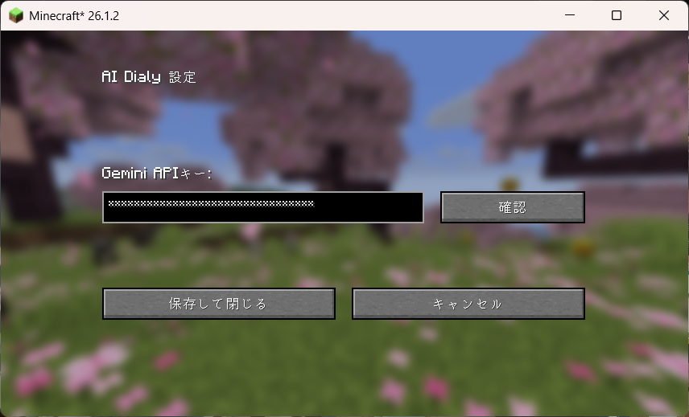
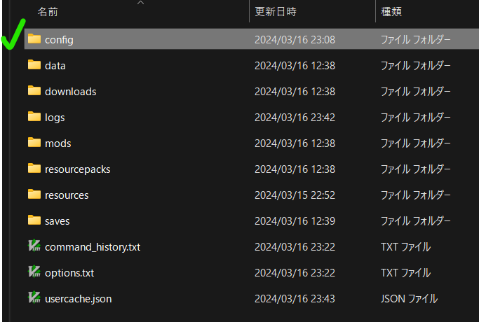
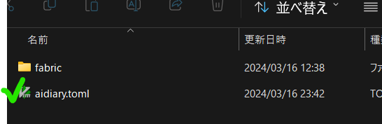
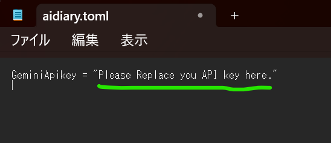

# AI日記生成mod

マイクラの日記をAIで自動生成します  
Fabric版とNeoForge版に対応しています。  
日付が変わるとチャットに自動生成された日記がポストされます  
生成する日記の中身はプレイ内容で変化します✌️

## ダウンロード

こちらサイトからダウンロードください  
[Modrinth ai-diary](https://modrinth.com/mod/ai-diary/versions#all-versions)

## 設定方法

以下の設定が必要です

1. 依存するmodのインストール
1. GeminiのAPIキーの取得
1. 取得したGeminiのAPIキーをmodに設定する

### 依存するmodのインストール

本modはFabric版とNeoForge版があります。

* **Fabric版**: 以下の依存modをインストールしてください
  * [Fabric API](https://modrinth.com/mod/fabric-api)
  * [Cloth Config API](https://modrinth.com/mod/cloth-config)
* **NeoForge版**: 追加の依存modは不要です

### GeminiのAPIキーの取得

* googleアカウントを用意してください
* [Google AI Studio](https://aistudio.google.com/)にアクセスします
* `Get API key`を選択し、`Create API Key`を選択します
  * 
* `Create API key in new project`を選択します
  * 
* APIキーが生成されますので、コピーしておいてください
  * 
  * **注意:** このAPIキーは自分以外の人には見せないようにしましょう

### 取得したGeminiのAPIキーをmodに設定する

#### ver3.1.0以降

* 設定メニューからAPIキーを設定してください
  * 

#### ver3.1.0未満

* 本modをインストールし、一度Minecraftを起動してください
* Minecraftの起動構成フォルダの`config`フォルダを確認します
  * 
* Fabric/NeoForgeともに `config/aidiary.toml` が作成されますので開いてください (テキストファイルです)
  * 
* `GeminiApikey = ""`という行の内容にAPIキーを記載してください
  * 
* Minecraftを再起動します
  * **注意:** APIキーの設定はMinecraftを再起動しないと反映されません

## 補足(注意事項)

* 現在Gemini APIが無料で利用できることに依存したmodです。  
  将来無料ではなくなった場合に、modが動作できなくなる可能性があります
