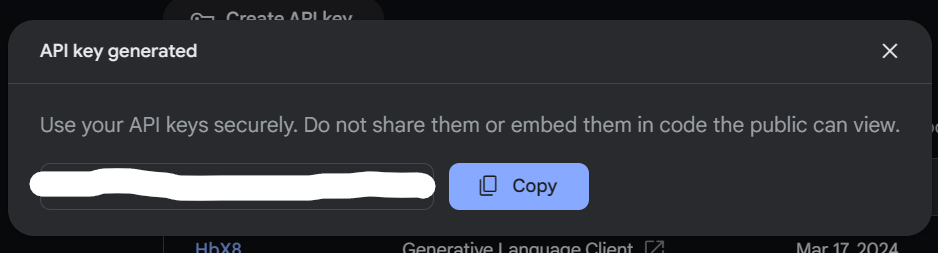

# AI Diary Mod

[日本語の説明はこちら](./README.ja.md)

Automatic Diary Generator by Gemini AI.  
Generated Diary will be posted as chat.  
Diary text depends on your playing✌️

# Download

please download published .jar from [Modrinth ai-diary](https://modrinth.com/mod/ai-diary/versions#all-versions)

# Setup

You need 3 steps to use this mod. 
+ Install dependency
+ Generate Gemini API key
+ Set API key to this mod

## Install dependency

please install followings:

* [fabric](https://modrinth.com/mod/fabric-api)
* [cloth-config](https://modrinth.com/mod/cloth-config)

## Generate Gemini API key

* prepare your Google account
* Access to [Google AI Studio](https://aistudio.google.com/)
* Select `Get API key`, and `Create API Key`
  * 
* Select `Create API key in new project`
  * 
* Copy Generated API key.
  * 
  * **NOTE:** Don't share this API key to ANYONE.

## Set API key to this mod

* Install this mod, and once start Minecraft.
* Open environment folder of Minecraft, and open `config` folder.
   * 
* Check `aidiary.toml` file exists. Open it. (this file is Text file.)
  * 
* Set API key into the line start as `GeminiApikey = `
  * 
* Restart Minecraft
  * **NOTE:** This configuration will be applyed after RESTARTED

# Note

* This mod relies on the Gemini API being available for free.  
  so, this mod may stop working if the API becomes paid.
